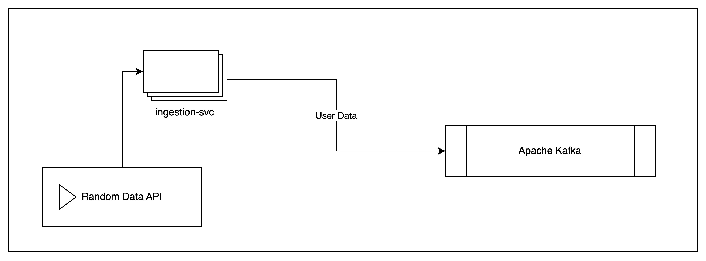

# ingestion-layer
The ingestion layer is a Go service that polls the Random Data API for user data, and then pushes it into an Apache Kafka instance

## Directory layout
```
`-- internal
    |-- kafka
    |-- service
```
* The top level directory 'internal' hosts the service and kafka modules
* The 'kafka' module is a utility to initialize and publish messages to a kafka instance
* The 'service' module has the entrypoint of the service, as well as a polling function to the Random Data API

## Environment Variable
KAFKA_URL : Kafka Instance Endpoint (default: localhost:9094)

## Running the application
```go run main.go
```

## Application Architecture
