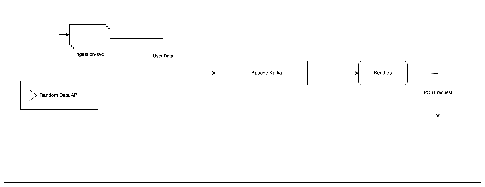

# processing-layer
The processing layer is a Benthos server that consumes from a Kafka instance, to then call an outbound API exposed by the storage-svc

## Running the application
```
benthos -c ./config.yaml
```

## Application Architecture
